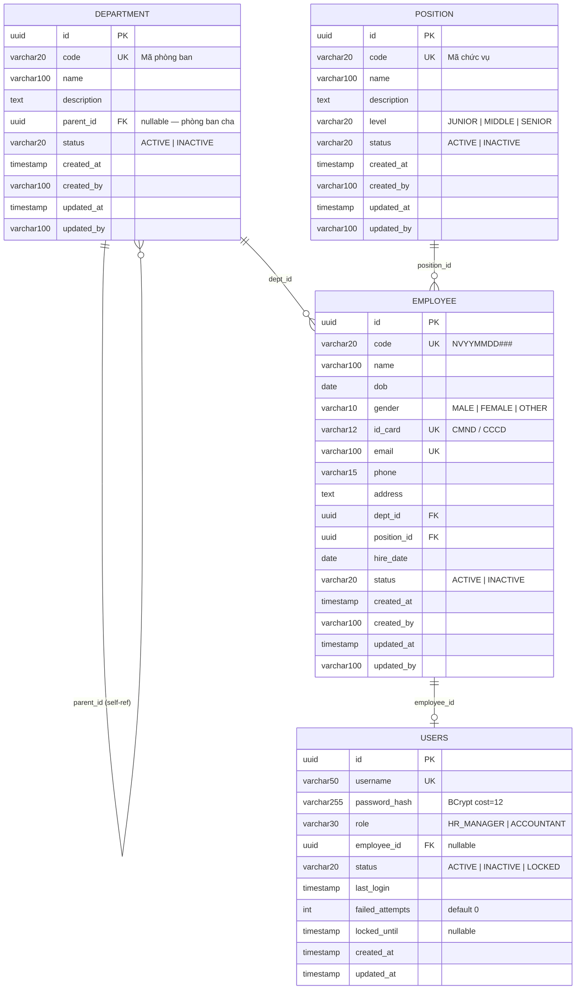
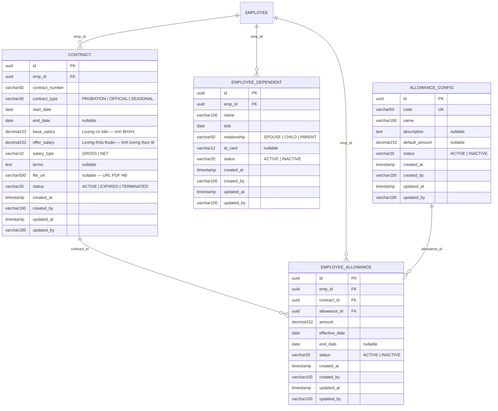
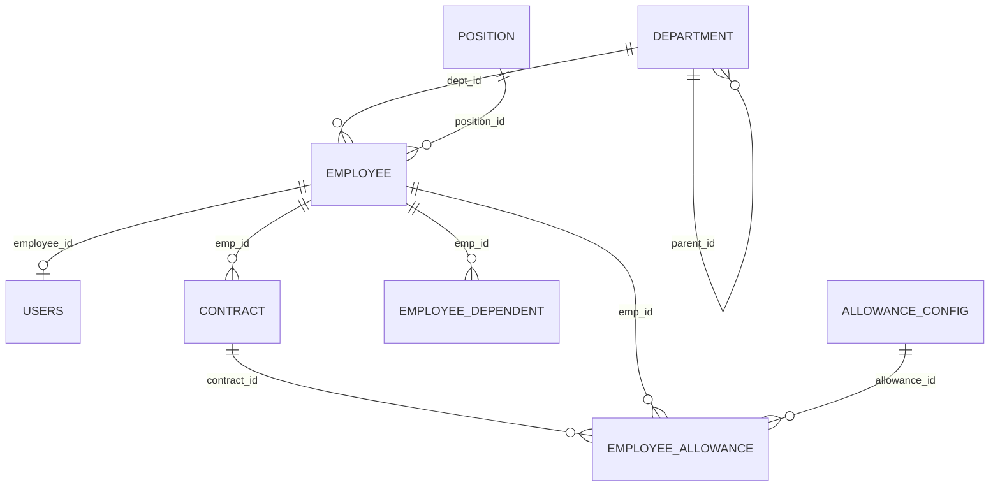

# ERD — Human Resource Management Module

**Document Information**

| Attribute | Details |
|-----------|---------|
| **Module** | Human Resource Management (HRM only) |
| **Document Version** | 1.0 |
| **Date** | 2026-04-28 |
| **Author** | Backend Lead |
| **Status** | Draft |
| **Tách từ** | ERD-HR-Module.md (combined HRM + Payroll) |

---

## Mục lục

1. [Tổng quan Schema](#1-tổng-quan-schema)
2. [Nhóm Core HR](#2-nhóm-core-hr)
3. [Nhóm Hợp đồng & Phụ cấp](#3-nhóm-hợp-đồng--phụ-cấp)
4. [Mối quan hệ tổng thể](#4-mối-quan-hệ-tổng-thể)
5. [Business Rules & Ràng buộc](#5-business-rules--ràng-buộc)

---

## 1. Tổng quan Schema

Module HRM quản lý **8 bảng** tổ chức và nhân sự — không phụ thuộc vào Payroll:

| Nhóm | Bảng | Mô tả |
|------|------|-------|
| **Core HR** | `department` | Cây phòng ban (self-referential) |
| | `position` | Danh mục chức vụ |
| | `employee` | Thông tin nhân viên — bảng trung tâm |
| | `users` | Tài khoản đăng nhập |
| **Hợp đồng & Phụ cấp** | `contract` | Hợp đồng lao động |
| | `employee_dependent` | Người phụ thuộc (giảm trừ gia cảnh) |
| | `allowance_config` | Danh mục loại phụ cấp |
| | `employee_allowance` | Phụ cấp gán cho nhân viên |

**Quy ước:**
- Primary Key: UUID (`gen_random_uuid()`)
- Mọi bảng đều có `created_at`, `updated_at`
- `status` mặc định `ACTIVE`
- Tiền tệ: `DECIMAL(15,2)`

**Ranh giới module (Boundary):**

| Phía ngoài | FK tham chiếu vào HRM | Chiều |
|------------|----------------------|-------|
| `payroll.emp_id` | `employee.id` | Payroll → HRM |
| `payroll.basic_salary` / `offer_salary` | snapshot từ `contract` | Payroll đọc, không FK trực tiếp |
| `attendance.emp_id` | `employee.id` | Payroll → HRM |
| `reward.emp_id` / `penalty.emp_id` | `employee.id` | Payroll → HRM |
| `hiring_plan.dept_id` / `position_id` | `department.id`, `position.id` | AI → HRM |

> HRM không có FK ngược về Payroll — đây là ranh giới 1 chiều, phù hợp để tách service sau này.

---

## 2. Nhóm Core HR

### ERD — Core HR

---

### 2.1 Bảng `department`

**Mô tả**: Quản lý cây phòng ban. Hỗ trợ phân cấp qua `parent_id` tự tham chiếu.

| Field | Type | Constraints | Default | Mô tả |
|-------|------|-------------|---------|-------|
| `id` | UUID | PK, NOT NULL | `gen_random_uuid()` | Primary key |
| `code` | VARCHAR(20) | UNIQUE, NOT NULL | — | Mã phòng ban (`DEPT-IT`, `DEPT-HR`…) |
| `name` | VARCHAR(100) | NOT NULL | — | Tên phòng ban |
| `description` | TEXT | NULLABLE | NULL | Mô tả chi tiết |
| `parent_id` | UUID | FK → department.id, NULLABLE | NULL | Phòng ban cha; NULL = cấp gốc |
| `status` | VARCHAR(20) | NOT NULL | `'ACTIVE'` | `ACTIVE` \| `INACTIVE` |
| `created_at` | TIMESTAMP | NOT NULL | `CURRENT_TIMESTAMP` | |
| `created_by` | VARCHAR(100) | NOT NULL | — | Username người tạo |
| `updated_at` | TIMESTAMP | NOT NULL | `CURRENT_TIMESTAMP` | |
| `updated_by` | VARCHAR(100) | NOT NULL | — | Username người cập nhật |

**Indexes:**
| Index | Fields | Ghi chú |
|-------|--------|---------|
| `idx_department_code` | `(code)` | |
| `idx_department_parent` | `(parent_id)` | `WHERE parent_id IS NOT NULL` |

**Quan hệ:**
- `department.parent_id` → `department.id` : self-referential N:1
- `department.id` ← `employee.dept_id` : 1 phòng ban có nhiều nhân viên

---

### 2.2 Bảng `position`

**Mô tả**: Danh mục chức vụ/vị trí công việc trong tổ chức.

| Field | Type | Constraints | Default | Mô tả |
|-------|------|-------------|---------|-------|
| `id` | UUID | PK, NOT NULL | `gen_random_uuid()` | |
| `code` | VARCHAR(20) | UNIQUE, NOT NULL | — | Mã chức vụ (`POS-DEV`, `POS-PM`…) |
| `name` | VARCHAR(100) | NOT NULL | — | Tên chức vụ |
| `description` | TEXT | NULLABLE | NULL | |
| `level` | VARCHAR(20) | NOT NULL | `'JUNIOR'` | `JUNIOR` \| `MIDDLE` \| `SENIOR` |
| `status` | VARCHAR(20) | NOT NULL | `'ACTIVE'` | `ACTIVE` \| `INACTIVE` |
| `created_at` | TIMESTAMP | NOT NULL | `CURRENT_TIMESTAMP` | |
| `created_by` | VARCHAR(100) | NOT NULL | — | |
| `updated_at` | TIMESTAMP | NOT NULL | `CURRENT_TIMESTAMP` | |
| `updated_by` | VARCHAR(100) | NOT NULL | — | |

**Indexes:**
| Index | Fields |
|-------|--------|
| `idx_position_code` | `(code)` |

**Quan hệ:**
- `position.id` ← `employee.position_id` : 1 chức vụ — nhiều nhân viên

---

### 2.3 Bảng `employee`

**Mô tả**: Thông tin nhân viên — bảng trung tâm của HRM module, các module khác (Payroll, AI) đều FK về đây.

| Field | Type | Constraints | Default | Mô tả |
|-------|------|-------------|---------|-------|
| `id` | UUID | PK, NOT NULL | `gen_random_uuid()` | |
| `code` | VARCHAR(20) | UNIQUE, NOT NULL | — | Format `NVYYMMDD###` — tự sinh theo ngày + sequence |
| `name` | VARCHAR(100) | NOT NULL | — | Họ và tên đầy đủ |
| `dob` | DATE | NOT NULL | — | Ngày sinh |
| `gender` | VARCHAR(10) | NOT NULL | — | `MALE` \| `FEMALE` \| `OTHER` |
| `id_card` | VARCHAR(12) | UNIQUE, NOT NULL | — | Số CMND/CCCD (12 chữ số) |
| `email` | VARCHAR(100) | UNIQUE, NOT NULL | — | Email |
| `phone` | VARCHAR(15) | NULLABLE | NULL | Số điện thoại |
| `address` | TEXT | NULLABLE | NULL | Địa chỉ thường trú |
| `dept_id` | UUID | FK → department.id, NOT NULL | — | Phòng ban hiện tại |
| `position_id` | UUID | FK → position.id, NOT NULL | — | Chức vụ hiện tại |
| `hire_date` | DATE | NOT NULL | — | Ngày vào làm |
| `status` | VARCHAR(20) | NOT NULL | `'ACTIVE'` | `ACTIVE` \| `INACTIVE` |
| `created_at` | TIMESTAMP | NOT NULL | `CURRENT_TIMESTAMP` | |
| `created_by` | VARCHAR(100) | NOT NULL | — | |
| `updated_at` | TIMESTAMP | NOT NULL | `CURRENT_TIMESTAMP` | |
| `updated_by` | VARCHAR(100) | NOT NULL | — | |

**Indexes:**
| Index | Fields | Mục đích |
|-------|--------|---------|
| `idx_employee_code` | `(code)` | Lookup nhanh theo mã NV |
| `idx_employee_email` | `(email)` | Auth lookup |
| `idx_employee_dept` | `(dept_id)` | Lọc NV theo phòng ban |
| `idx_employee_status` | `(status)` | Lọc NV đang active |

**Quan hệ (HRM):**
- `employee.dept_id` → `department.id` (N:1)
- `employee.position_id` → `position.id` (N:1)
- `employee.id` ← `users.employee_id` (1:1)
- `employee.id` ← `contract.emp_id` (1:N)
- `employee.id` ← `employee_dependent.emp_id` (1:N)
- `employee.id` ← `employee_allowance.emp_id` (1:N)

---

### 2.4 Bảng `users`

**Mô tả**: Tài khoản đăng nhập hệ thống, liên kết 1-1 với nhân viên.

| Field | Type | Constraints | Default | Mô tả |
|-------|------|-------------|---------|-------|
| `id` | UUID | PK, NOT NULL | `gen_random_uuid()` | |
| `username` | VARCHAR(50) | UNIQUE, NOT NULL | — | Tên đăng nhập |
| `password_hash` | VARCHAR(255) | NOT NULL | — | BCrypt cost factor 12 |
| `role` | VARCHAR(30) | NOT NULL | — | `HR_MANAGER` \| `ACCOUNTANT` |
| `employee_id` | UUID | FK → employee.id, NULLABLE | NULL | NULL = system admin account |
| `status` | VARCHAR(20) | NOT NULL | `'ACTIVE'` | `ACTIVE` \| `INACTIVE` \| `LOCKED` |
| `last_login` | TIMESTAMP | NULLABLE | NULL | |
| `failed_attempts` | INT | NOT NULL | `0` | Số lần đăng nhập sai liên tiếp |
| `locked_until` | TIMESTAMP | NULLABLE | NULL | |
| `created_at` | TIMESTAMP | NOT NULL | `CURRENT_TIMESTAMP` | |
| `updated_at` | TIMESTAMP | NOT NULL | `CURRENT_TIMESTAMP` | |

**Indexes:**
| Index | Fields |
|-------|--------|
| `idx_users_username` | `(username)` |

**Business Logic:**
- `failed_attempts >= 5` → `status = LOCKED`, `locked_until = NOW() + 15 minutes`
- JWT expiry: 1 giờ
- Chỉ tài khoản `ACTIVE` mới đăng nhập được

---

## 3. Nhóm Hợp đồng & Phụ cấp

### ERD — Hợp đồng & Phụ cấp

---

### 3.1 Bảng `contract`

**Mô tả**: Hợp đồng lao động. Một nhân viên có nhiều hợp đồng theo thời gian, chỉ 1 `ACTIVE` tại một thời điểm.

| Field | Type | Constraints | Default | Mô tả |
|-------|------|-------------|---------|-------|
| `id` | UUID | PK, NOT NULL | `gen_random_uuid()` | |
| `emp_id` | UUID | FK → employee.id, NOT NULL | — | |
| `contract_number` | VARCHAR(50) | NOT NULL | — | Số hợp đồng (`HĐ-2026-001`) |
| `contract_type` | VARCHAR(30) | NOT NULL | — | `PROBATION` \| `OFFICIAL` \| `SEASONAL` |
| `start_date` | DATE | NOT NULL | — | Ngày bắt đầu hiệu lực |
| `end_date` | DATE | NULLABLE | NULL | NULL = không xác định thời hạn |
| `base_salary` | DECIMAL(15,2) | NOT NULL, > 0 | — | Lương cơ bản — Payroll module dùng tính BHXH |
| `offer_salary` | DECIMAL(15,2) | NOT NULL, > 0 | — | Lương thỏa thuận — Payroll dùng tính lương theo công |
| `salary_type` | VARCHAR(10) | NOT NULL | `'GROSS'` | `GROSS` \| `NET` |
| `terms` | TEXT | NULLABLE | NULL | Điều khoản đặc biệt |
| `file_url` | VARCHAR(500) | NULLABLE | NULL | URL PDF hợp đồng scan |
| `status` | VARCHAR(20) | NOT NULL | `'ACTIVE'` | `ACTIVE` \| `EXPIRED` \| `TERMINATED` |
| `created_at` | TIMESTAMP | NOT NULL | `CURRENT_TIMESTAMP` | |
| `created_by` | VARCHAR(100) | NOT NULL | — | |
| `updated_at` | TIMESTAMP | NOT NULL | `CURRENT_TIMESTAMP` | |
| `updated_by` | VARCHAR(100) | NOT NULL | — | |

**Constraints:**
- `UNIQUE(emp_id, start_date)` — không 2 hợp đồng cùng NV bắt đầu cùng ngày
- `CHECK(end_date IS NULL OR end_date >= start_date)`
- `CHECK(base_salary > 0 AND offer_salary > 0)`

**Indexes:**
| Index | Fields |
|-------|--------|
| `idx_contract_emp` | `(emp_id)` |
| `idx_contract_status` | `(status)` |

**Phân biệt `base_salary` vs `offer_salary`:**

| Loại | Dùng cho | Ví dụ |
|------|----------|-------|
| `base_salary` | Tính BHXH (8%), BHTN (1%), BHYT (1.5%) | 4,680,000 VNĐ (mức đóng tối thiểu) |
| `offer_salary` | Tính lương theo công, lương OT | 20,000,000 VNĐ (lương thực tế) |

---

### 3.2 Bảng `employee_dependent`

**Mô tả**: Người phụ thuộc — HRM lưu để Payroll tính giảm trừ gia cảnh thuế TNCN (4.4 triệu/người/tháng).

| Field | Type | Constraints | Default | Mô tả |
|-------|------|-------------|---------|-------|
| `id` | UUID | PK, NOT NULL | `gen_random_uuid()` | |
| `emp_id` | UUID | FK → employee.id, NOT NULL | — | |
| `name` | VARCHAR(100) | NOT NULL | — | Họ tên người phụ thuộc |
| `dob` | DATE | NOT NULL | — | Ngày sinh |
| `relationship` | VARCHAR(50) | NOT NULL | — | `SPOUSE` \| `CHILD` \| `PARENT` |
| `id_card` | VARCHAR(12) | NULLABLE | NULL | CMND/CCCD người phụ thuộc |
| `status` | VARCHAR(20) | NOT NULL | `'ACTIVE'` | `ACTIVE` \| `INACTIVE` |
| `created_at` | TIMESTAMP | NOT NULL | `CURRENT_TIMESTAMP` | |
| `updated_at` | TIMESTAMP | NOT NULL | `CURRENT_TIMESTAMP` | |

**Indexes:**
| Index | Fields |
|-------|--------|
| `idx_dependent_emp` | `(emp_id)` |

---

### 3.3 Bảng `allowance_config`

**Mô tả**: Danh mục các loại phụ cấp (template). HR Manager định nghĩa tại đây, sau đó gán vào từng nhân viên qua `employee_allowance`.

| Field | Type | Constraints | Default | Mô tả |
|-------|------|-------------|---------|-------|
| `id` | UUID | PK, NOT NULL | `gen_random_uuid()` | |
| `code` | VARCHAR(50) | UNIQUE, NOT NULL | — | `ALW-MEAL`, `ALW-PHONE`, `ALW-TRANSPORT`… |
| `name` | VARCHAR(100) | NOT NULL | — | Tên phụ cấp |
| `description` | TEXT | NULLABLE | NULL | |
| `default_amount` | DECIMAL(15,2) | NULLABLE | NULL | Số tiền đề xuất khi gán cho nhân viên |
| `status` | VARCHAR(20) | NOT NULL | `'ACTIVE'` | `ACTIVE` \| `INACTIVE` |
| `created_at` | TIMESTAMP | NOT NULL | `CURRENT_TIMESTAMP` | |
| `updated_at` | TIMESTAMP | NOT NULL | `CURRENT_TIMESTAMP` | |

---

### 3.4 Bảng `employee_allowance`

**Mô tả**: Phụ cấp thực tế gán cho từng nhân viên theo hợp đồng. Payroll đọc bảng này để tính tổng phụ cấp tháng.

| Field | Type | Constraints | Default | Mô tả |
|-------|------|-------------|---------|-------|
| `id` | UUID | PK, NOT NULL | `gen_random_uuid()` | |
| `emp_id` | UUID | FK → employee.id, NOT NULL | — | |
| `contract_id` | UUID | FK → contract.id, NOT NULL | — | Hợp đồng gắn phụ cấp |
| `allowance_id` | UUID | FK → allowance_config.id, NOT NULL | — | Loại phụ cấp |
| `amount` | DECIMAL(15,2) | NOT NULL | — | Số tiền thực tế |
| `effective_date` | DATE | NOT NULL | — | Ngày bắt đầu hưởng |
| `end_date` | DATE | NULLABLE | NULL | NULL = vô thời hạn |
| `status` | VARCHAR(20) | NOT NULL | `'ACTIVE'` | `ACTIVE` \| `INACTIVE` |
| `created_at` | TIMESTAMP | NOT NULL | `CURRENT_TIMESTAMP` | |
| `updated_at` | TIMESTAMP | NOT NULL | `CURRENT_TIMESTAMP` | |

**Indexes:**
| Index | Fields |
|-------|--------|
| `idx_emp_allowance_emp` | `(emp_id)` |
| `idx_emp_allowance_contract` | `(contract_id)` |

---

## 4. Mối quan hệ tổng thể

### ERD Full — 8 bảng HRM

### FK Matrix

| Bảng con | Field FK | Bảng cha | Cardinality | Ghi chú |
|----------|----------|----------|-------------|---------|
| `department` | `parent_id` | `department` | N:1 | Self-referential, NULLABLE |
| `employee` | `dept_id` | `department` | N:1 | |
| `employee` | `position_id` | `position` | N:1 | |
| `users` | `employee_id` | `employee` | 1:1 | NULLABLE (system accounts) |
| `contract` | `emp_id` | `employee` | N:1 | |
| `employee_dependent` | `emp_id` | `employee` | N:1 | |
| `employee_allowance` | `emp_id` | `employee` | N:1 | |
| `employee_allowance` | `contract_id` | `contract` | N:1 | |
| `employee_allowance` | `allowance_id` | `allowance_config` | N:1 | |

---

## 5. Business Rules & Ràng buộc

### 5.1 Quy tắc quản lý nhân viên

| Rule | Mô tả |
|------|-------|
| **Mã nhân viên** | Format `NVYYMMDD###` — tự sinh, không chỉnh sửa thủ công |
| **CMND/Email unique** | `id_card` và `email` phải unique toàn hệ thống |
| **Dept + Position** | Nhân viên phải có phòng ban và chức vụ hợp lệ (`ACTIVE`) khi tạo mới |
| **Soft delete** | Không xóa cứng — set `status = INACTIVE` |

### 5.2 Quy tắc hợp đồng

| Rule | Mô tả |
|------|-------|
| **1 hợp đồng ACTIVE** | Một nhân viên chỉ có 1 hợp đồng `ACTIVE` tại một thời điểm |
| **Ngày trùng** | `UNIQUE(emp_id, start_date)` — không 2 hợp đồng bắt đầu cùng ngày |
| **Salary positive** | `base_salary > 0` và `offer_salary > 0` — CHECK constraint |
| **Hết hạn** | Khi ký HĐ mới → set HĐ cũ `status = EXPIRED` (app logic, không trigger) |

### 5.3 Quy tắc tài khoản

| Điều kiện | Hành động |
|-----------|-----------|
| `failed_attempts >= 5` | `status = LOCKED`, `locked_until = NOW() + 15 min` |
| Hết `locked_until` | App reset `status = ACTIVE`, `failed_attempts = 0` |
| Đăng nhập thành công | Reset `failed_attempts = 0`, ghi `last_login` |

### 5.4 Audit Trail

| Bảng | `created_at` | `created_by` | `updated_at` | `updated_by` | Ghi chú |
|------|:---:|:---:|:---:|:---:|---------|
| `department` | ✓ | ✓ | ✓ | ✓ | |
| `position` | ✓ | ✓ | ✓ | ✓ | |
| `employee` | ✓ | ✓ | ✓ | ✓ | |
| `users` | ✓ | ✗ | ✓ | ✗ | Tài khoản hệ thống — không audit _by |
| `contract` | ✓ | ✓ | ✓ | ✓ | |
| `employee_dependent` | ✓ | ✓ | ✓ | ✓ | |
| `allowance_config` | ✓ | ✓ | ✓ | ✓ | |
| `employee_allowance` | ✓ | ✓ | ✓ | ✓ | |

---

**END OF DOCUMENT**
